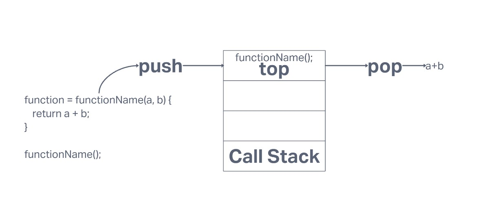

## [Understanding the JavaScript Call Stack](https://medium.freecodecamp.org/understanding-the-javascript-call-stack-861e41ae61d4)

### What is a ‘call’?

* This is a function invocation that uses the method .call();

### How many ‘calls’ can happen at once?

* Javascript is only able to process one call at a time

### What does LIFO mean?

* Last In First Out this means that last function pushed into the call stack is the first function returned

### Draw an example of a call stack and the functions that would need to be invoked to generate that call stack

### What causes a Stack Overflow?

* A stack overflow occurs when there is a recursive function (a function that calls itself) without an exit point

## [JavaScript error messages](https://codeburst.io/javascript-error-messages-debugging-d23f84f0ae7c)

### What is a ‘reference error’?

* Trying to use a variable that has not yet been referenced

### What is a ‘syntax error’?

* Errors related to the improper use of syntax

### What is a ‘range error’?

* Manipulating an object that has a defined length and attempting to pass it an invalid length

### What is a ‘type error’?

* Theses are errors that occur when the type of object that you are trying to manipulate is of the wrong type

### What is a breakpoint?

* You set breakpoints wherever you want to pause debugger execution

### What does the word ‘debugger’ do in your code?

* Debugging means to run your code step by step in a debugging tool like Visual Studio, to find the exact point where you made a programming mistake.

Bookmark and Review

[JavaScript errors reference on MDN](https://developer.mozilla.org/en-US/docs/Web/JavaScript/Reference/Errors)
