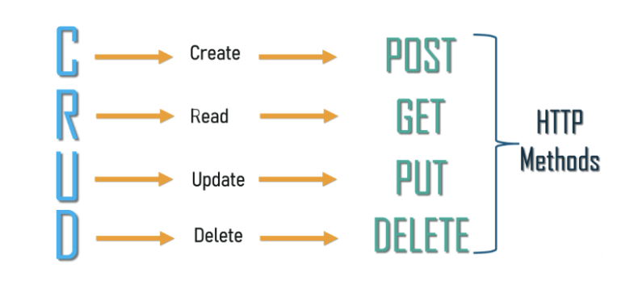

## [CRUD Basics](https://medium.com/geekculture/crud-operations-explained-2a44096e9c88)

### Which HTTP method would you use to update a record through an API?

* Put

### Which REST methods require an ID parameter?

* Update and Delete

## [Speed Coding: Building a CRUD API](https://www.youtube.com/watch?v=EzNcBhSv1Wo)

### What’s the relationship between REST and CRUD?

* CRUD is a cycle that can be mapped to REST

### If you had to describe the process of creating a RESTful API in 5 steps, what would they be?

* Identify the object model

* Identify the URIs (routes)

* Define the Representations

* Assign HTTP Methods

* Identify HTTP Status codes
