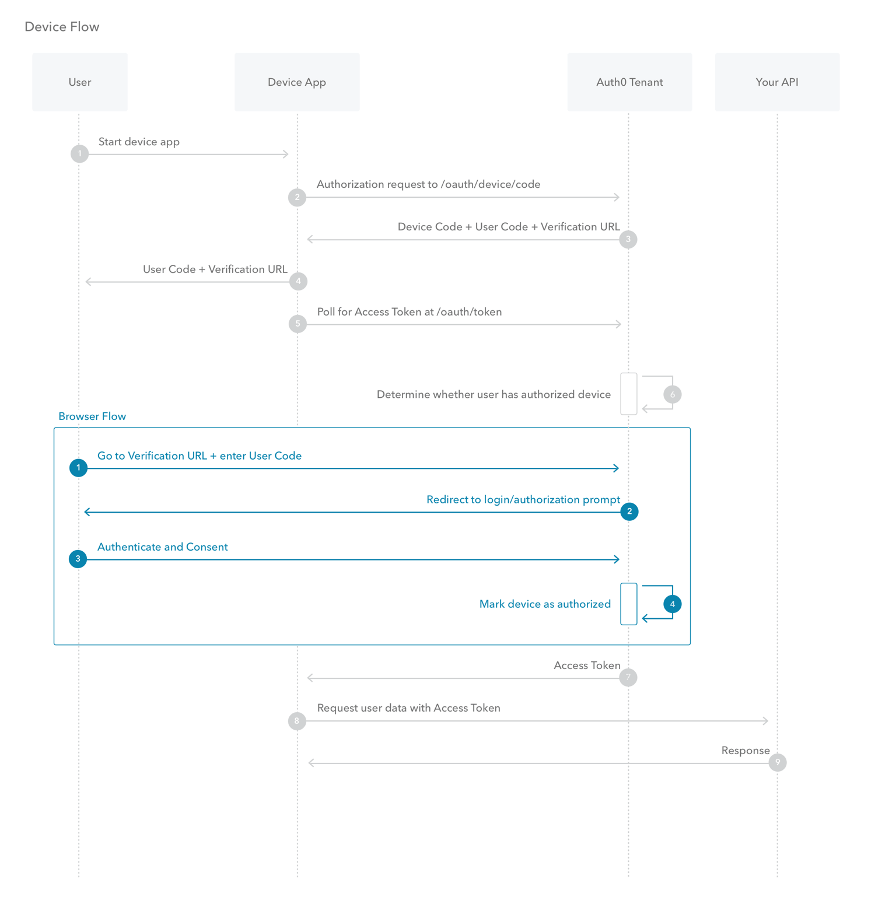
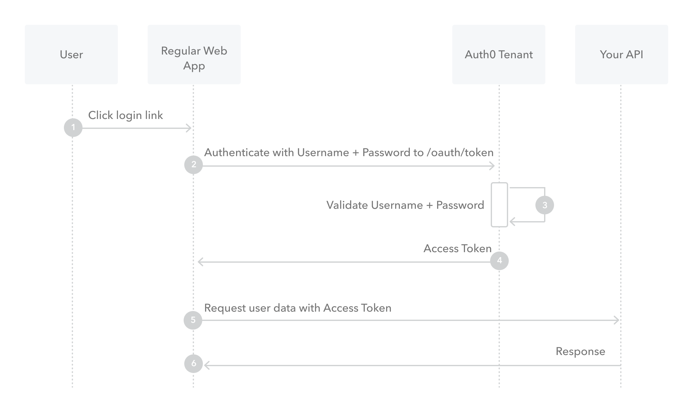

## [What is OAuth](https://www.csoonline.com/article/3216404/what-is-oauth-how-the-open-authorization-framework-works.html)

### What is OAuth?

* OAuth is a method used to securely authorize a user by proxy of a secondary service.

### Give an example of what using OAuth would look like

* One example would be logging into a third party website by using your google account credentials.

### How does OAuth work? What are the steps that it takes to authenticate the user?

* The first website connects to the second website on behalf of the user, using OAuth, providing the user’s verified identity.
*

The second site generates a one-time token and a one-time secret unique to the transaction and parties involved.
*
The first site gives this token and secret to the initiating user’s client software.
*
The client’s software presents the request token and secret to their authorization provider (which may or may not be the second site).
If not already authenticated to the authorization provider, the client may be asked to authenticate. After authentication, the client is asked to approve the authorization transaction to the second website.
*
The user approves (or their software silently approves) a particular transaction type at the first website.
*
The user is given an approved access token (notice it’s no longer a request token).
*
The user gives the approved access token to the first website.
*
The first website gives the access token to the second website as proof of authentication on behalf of the user.
*
The second website lets the first website access their site on behalf of the user.

* he user sees a successfully completed transaction occurring.

### What is OpenID?

* Open ID is a similar concept to OAuth except it OpenID is about authentication (ie. proving who you are), OAuth is about authorisation (ie. to grant access to functionality/data/etc.. without having to deal with the original authentication).

## [Authorization and Authentication flows](https://auth0.com/docs/flows)

### What is the difference between authorization and authentication?

* Authorization is when you are given permission, authentication is when you must prove who you are

### What is Authorization Code Flow?

* This is the process of exchanging a token and receiving authorization in return

### What is Authorization Code Flow with Proof Key for Code Exchange (PKCE)?

* The PKCE-enhanced Authorization Code Flow introduces a secret created by the calling application that can be verified by the authorization server; this secret is called the Code Verifier. Additionally, the calling app creates a transform value of the Code Verifier called the Code Challenge and sends this value over HTTPS to retrieve an Authorization Code. This way, a malicious attacker can only intercept the Authorization Code, and they cannot exchange it for a token without the Code Verifier.

### What is Implicit Flow with Form Post?

* The web app requests and obtains tokens through the front channel, without the need for secrets or extra backend calls. With this method, you don’t need to obtain, maintain, use, and protect a secret in your application.

### What is Client Credentials Flow?

* M2M apps use the Client Credentials Flow in which they pass along their Client ID and Client Secret to authenticate themselves and get a token.

### What is Device Authorization Flow?

* The Device Authorization Flow contains two different paths; one occurs on the device requesting authorization and the other occurs in a browser. The browser flow path, wherein a device code is bound to the session in the browser, occurs in parallel to part of the device flow path.

### What is Resource Owner Password Flow

* Though we do not recommend it, highly-trusted applications can use the Resource Owner Password Flow which requests that users provide credentials (username and password), typically using an interactive form. This is not recommended due to credentials being stored within a database after submission.

### Bookmark and Review

[Auth0 for single page apps](https://auth0.com/docs/libraries/auth0-react)
