### [SQL Query turotial](https://sqlbolt.com/lesson/)

* Going through these exercises showed me that a SQL database is nearly identical to an excel worksheet and relational databases are similar to an excel workbook. I found that these exercises were easy to navigate and comprehend due to my experience working with excel worksheets and using the various filtering options to return the data that I need.

> Relational databases are among the most popular types of databases because they allow users to easily understand data points that are related to each other in one or more tables and provide relational operators such as structured query language (SQL) to query and manipulate the data. As a result, they are often used for a well-structured data model or for transactional queries in which the data structure does not change often.

[Google Relational Databases](https://cloud.google.com/learn/what-is-a-relational-database#:~:text=Relational%20databases%20are%20among%20the,query%20and%20manipulate%20the%20data.)

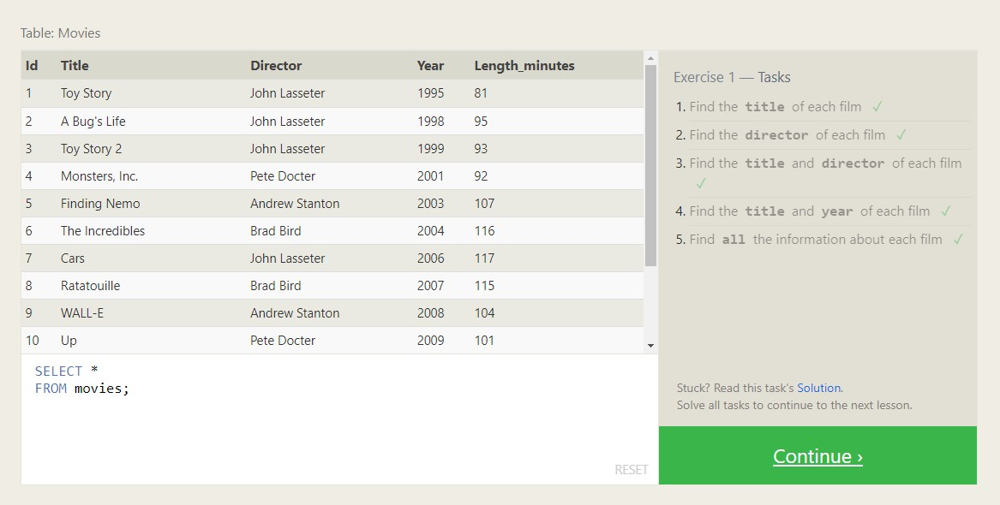

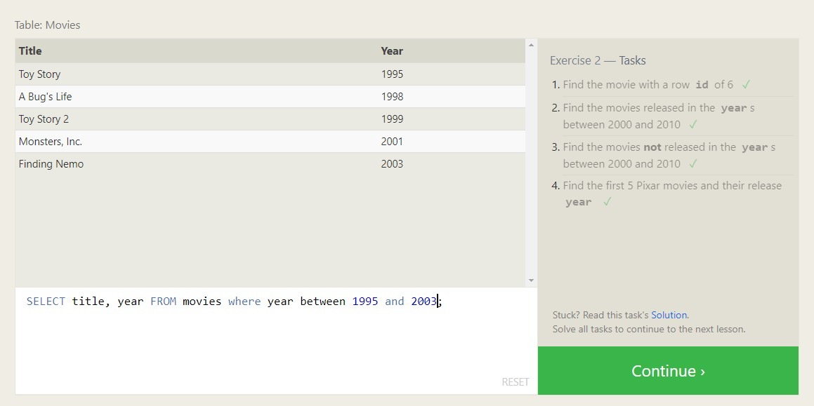

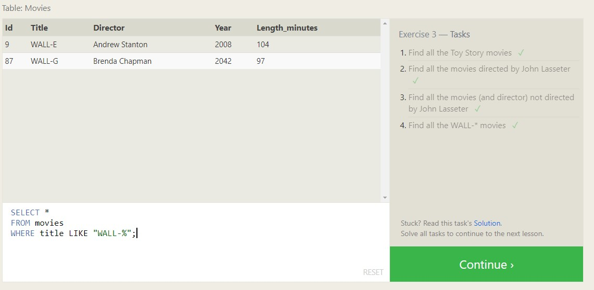

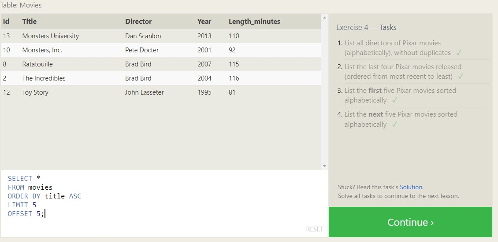

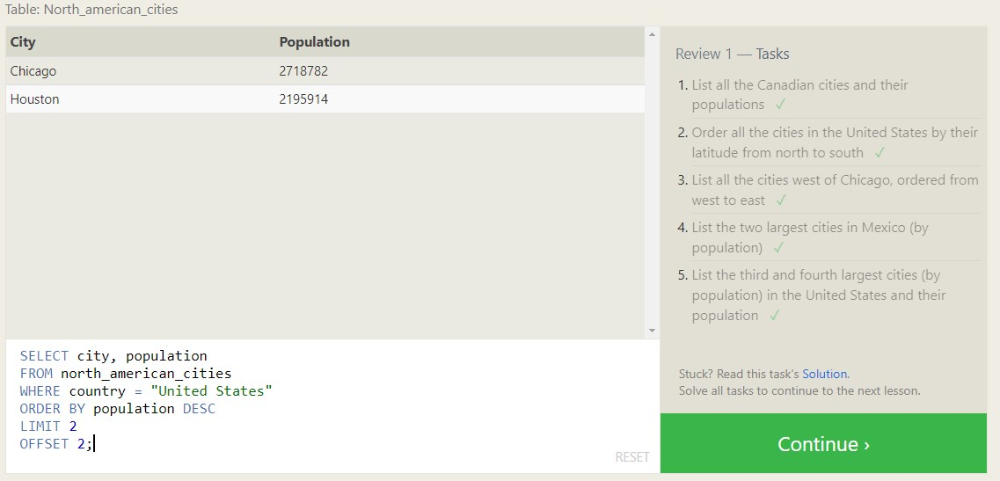

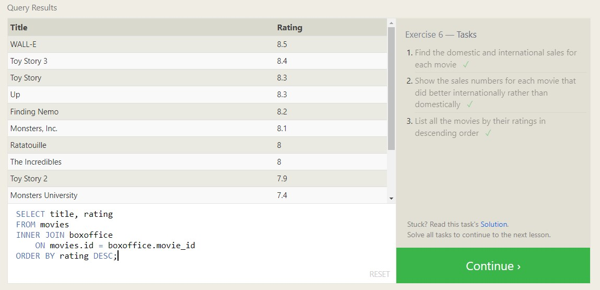

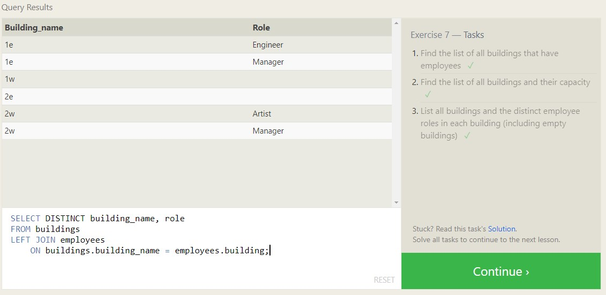

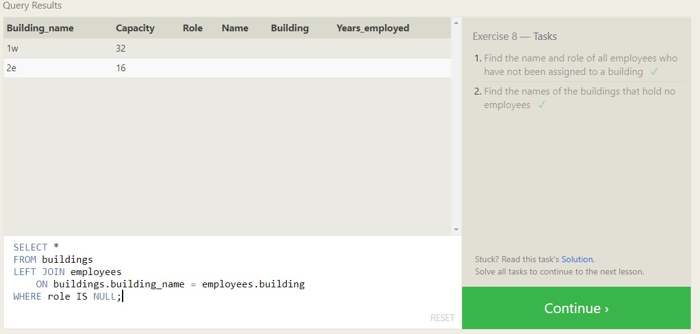

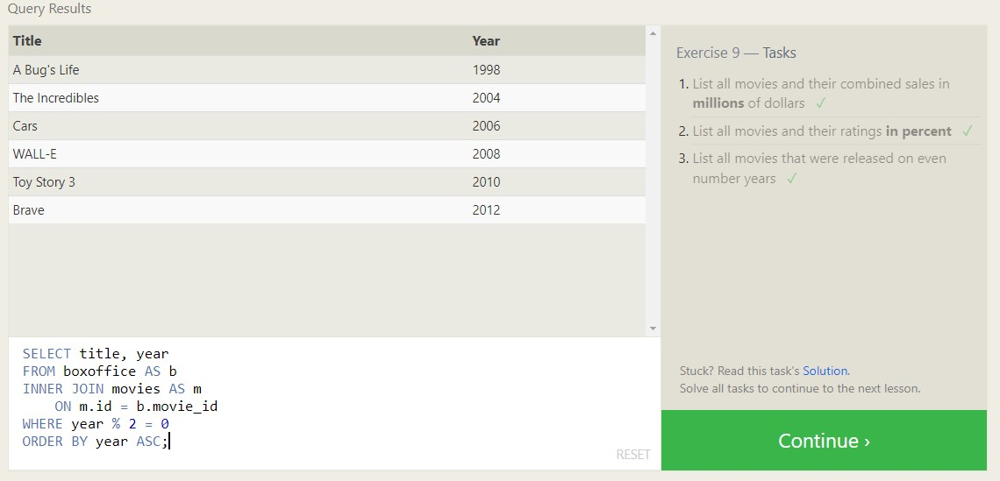

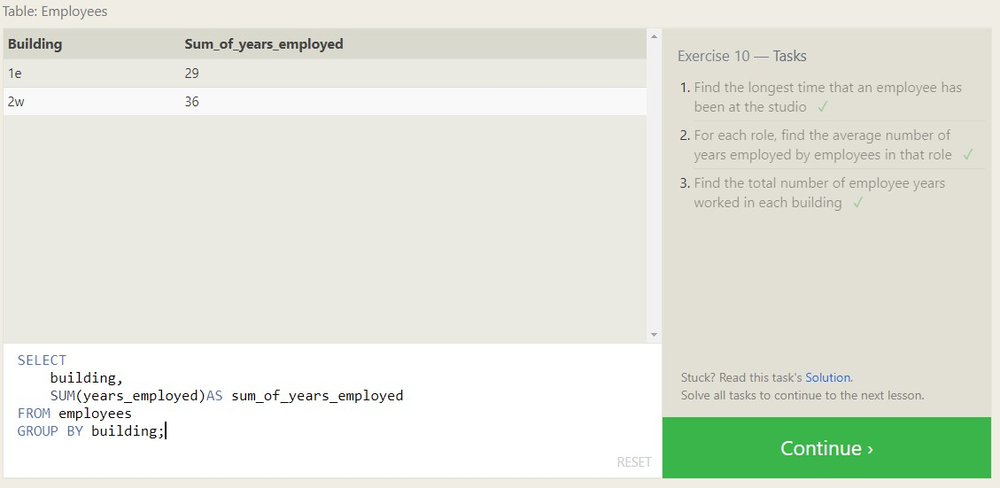

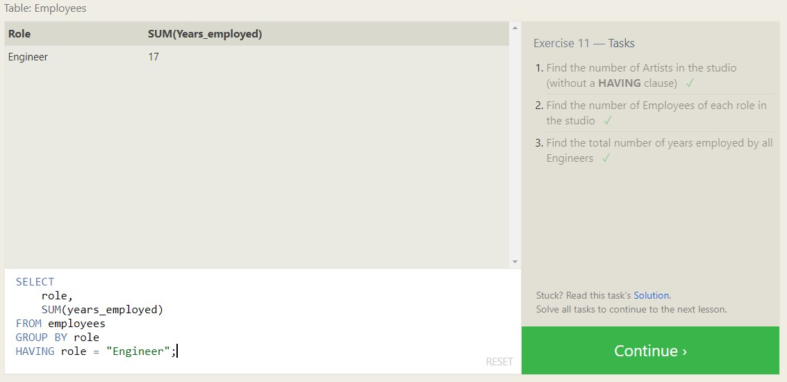

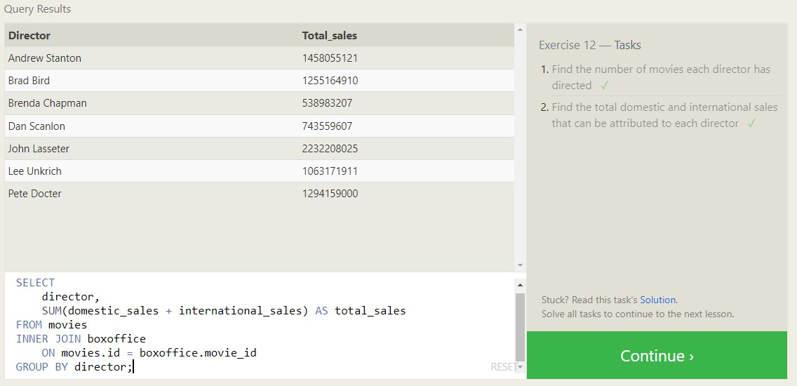

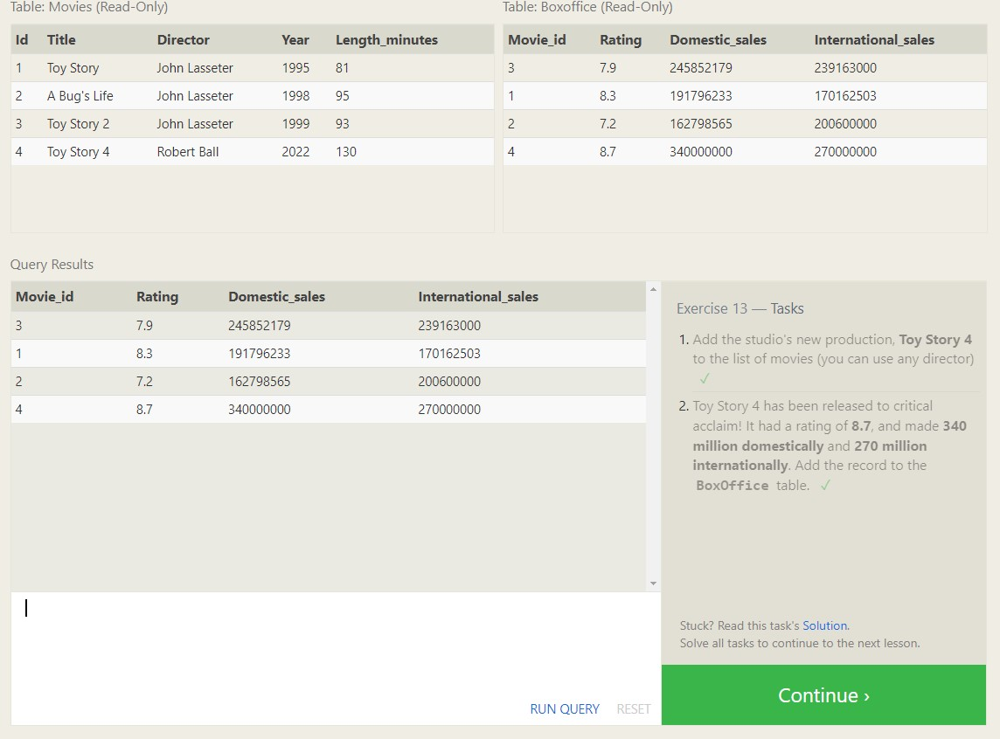

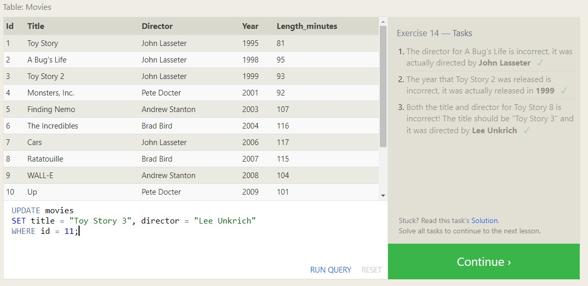

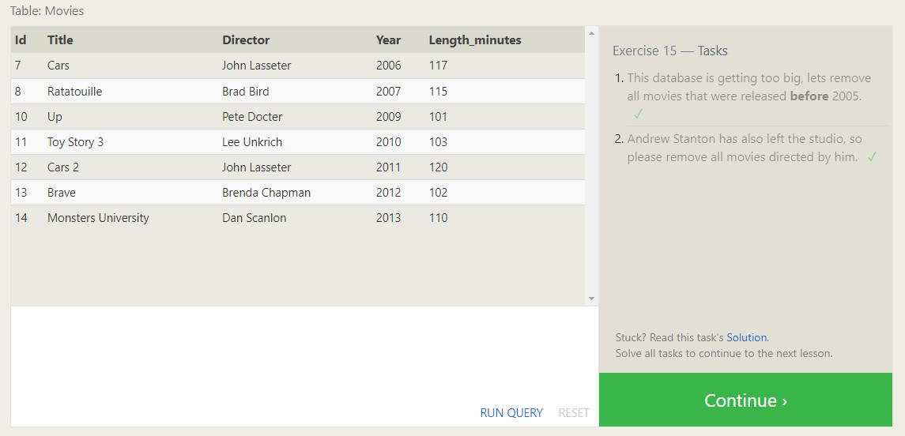

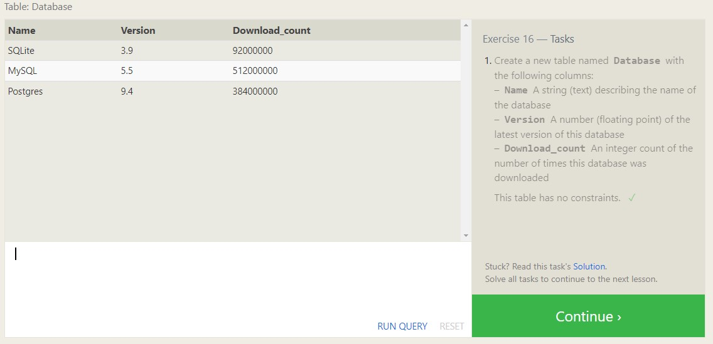

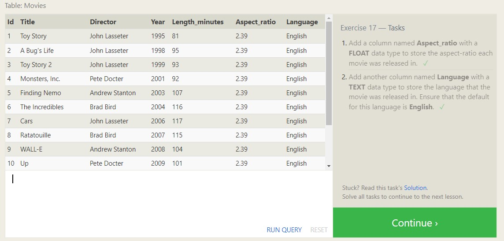

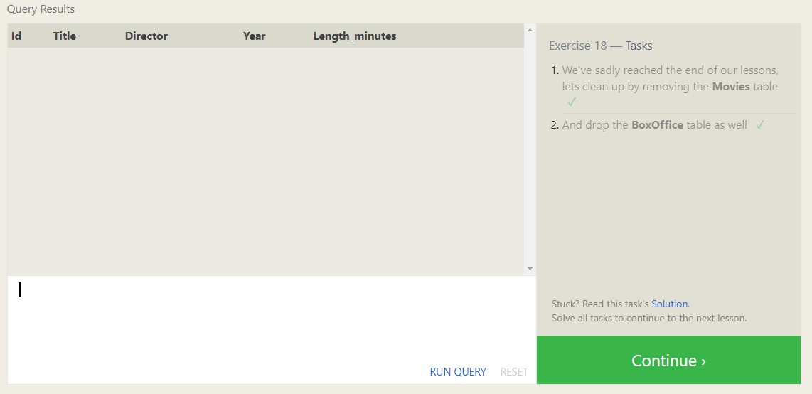
